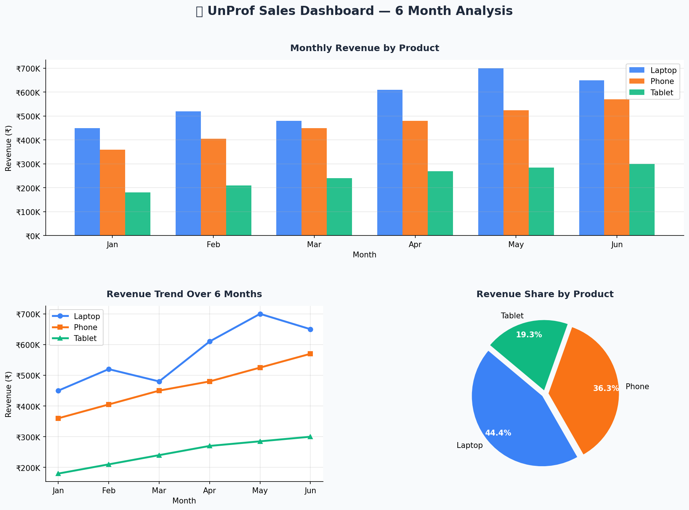

# UnProf_Pyai_7
Python sales data dashboard using NumPy and Matplotlib — bar, line &amp; pie charts generated from a 6-month dataset.

<div align="center">

# 📊 Sales Data Dashboard

A Python data visualization project built with **NumPy** and **Matplotlib** that analyzes 6 months of sales data and generates a 3-chart dashboard.

[](https://www.linkedin.com/in/atharva-phatangare)
[](https://github.com/atharva-9423/UnProf_Pyai_7)


</div>

---

## ✨ Features

| Feature | Description |
|---|---|
| 🔢 NumPy Analysis | Revenue stats: total, average, max, min, std deviation |
| 📊 Bar Chart | Monthly revenue comparison across Laptop, Phone & Tablet |
| 📈 Line Chart | Revenue growth trend over 6 months per product |
| 🥧 Pie Chart | Total revenue share distribution by product |
| 💾 Auto Save | Dashboard exported as `sales_dashboard.png` automatically |

---

## 🖼️ Dashboard Preview



---

## 📺 Sample Analysis Output

```
📌 NumPy Array — All Revenue Values:
  [450000 360000 180000 520000 ...]

📌 Basic Stats (NumPy):
  Total Revenue   : ₹13,230,000
  Average Revenue : ₹367,500
  Max Revenue     : ₹700,000
  Min Revenue     : ₹180,000
  Std Deviation   : ₹139,588

📌 Product-wise Total Revenue:
  Laptop  : ₹3,410,000
  Phone   : ₹2,790,000
  Tablet  : ₹1,485,000
```

---

## 🧠 Concepts Used

- **NumPy Arrays** — revenue and units data stored as NumPy arrays
- **Array Slicing** — `all_revenue[:9]` to extract first 3 months
- **NumPy Stats** — `np.sum()`, `np.mean()`, `np.max()`, `np.std()`
- **Bar Chart** — grouped bars comparing 3 products across 6 months
- **Line Chart** — multi-line trend showing growth per product
- **Pie Chart** — percentage revenue share with exploded segments

---

## 📁 File Structure

```
📂 day-7/
├── sales_dashboard.py    ← Main analysis & visualization script
├── sales_data.csv        ← 6-month sales dataset
├── sales_dashboard.png   ← Auto-generated dashboard image
└── README.md             ← This file
```

---

## 🚀 How To Run

**Step 1** — Install dependencies:
```bash
pip install numpy pandas matplotlib
```

**Step 2** — Clone the repo and navigate to day-7:
```bash
git clone https://github.com/atharva-9423/UnProf_Pyai_7
cd
```

**Step 3** — Run the script:
```bash
python3 sales_dashboard.py
```

The dashboard will display on screen and save as `sales_dashboard.png` in the same folder.

---

## 📅 Internship Context

Built as part of **Day 7 – NumPy & Data Visualization** of my Python & AI Internship at **UnProf**.

---

<div align="center">

Made with ❤️ by **Atharva Phatangare**

[](https://www.linkedin.com/in/atharva-phatangare)
[](https://github.com/atharva-9423)

</div>
